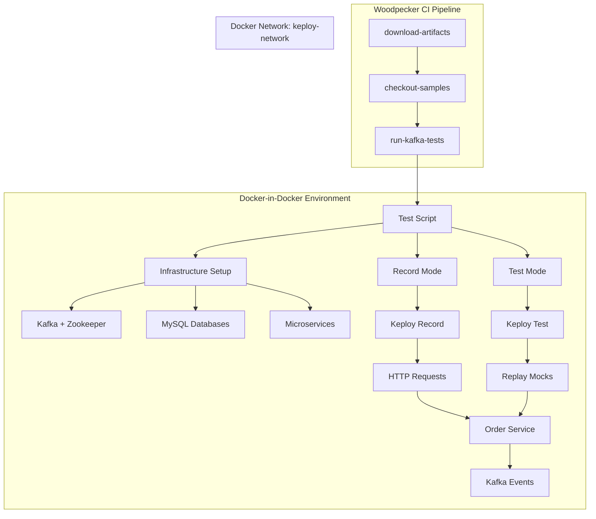

# Design Document: Kafka CI/CD Pipeline

## Overview

This design document specifies the technical implementation of a Woodpecker CI/CD pipeline that validates Keploy's Kafka integration capabilities using the ecommerce sample application. The pipeline will test Keploy's ability to record and replay Kafka message interactions in a containerized CI environment.

The implementation consists of two primary artifacts:
1. **Pipeline Configuration** (`enterprise/.woodpecker/kafka-ecommerce.yml`) - Woodpecker CI pipeline definition
2. **Test Script** (`enterprise/.ci/scripts/kafka-ecommerce.sh`) - Bash script orchestrating the Kafka integration test

The pipeline follows the established pattern from `sqs-localstack.yml` but adapts it for Kafka's more complex infrastructure requirements (Zookeeper dependency, topic management, multiple microservices).

### Key Design Decisions

**Why Kafka over other message brokers?**
Kafka is widely used in production microservices architectures for event streaming. Testing Keploy's Kafka support validates a critical integration point for enterprise users.

**Why the ecommerce sample app?**
The order_service provides a realistic use case: HTTP requests trigger Kafka events (order creation), which are consumed by the same service. This tests both producer and consumer recording/replay.

**Why Docker-in-Docker?**
The CI environment needs to run multiple containerized services (Kafka, Zookeeper, MySQL, microservices) while Keploy intercepts network traffic using eBPF. Docker-in-Docker provides the necessary isolation and privileged access.

## Architecture

### System Components



### Pipeline Flow

1. **Artifact Download Phase**
   - Downloads pre-built Keploy binary (`keployE`) from MinIO
   - Downloads enterprise Docker image tar file
   - Authenticates using GitHub App credentials

2. **Sample Checkout Phase**
   - Clones ecommerce_sample_app repository
   - Shallow clone for speed (depth 1)

3. **Test Execution Phase**
   - Starts Docker daemon with registry mirror
   - Loads enterprise Docker image
   - Executes test script in Docker-in-Docker environment

### Infrastructure Architecture

The test script creates a Docker network (`keploy-network`) and orchestrates the following containers:

```
keploy-network
├── zookeeper:2181          (Kafka coordination)
├── kafka:9092              (Message broker)
├── mysql-users:3306        (User service database)
├── mysql-products:3306     (Product service database)
├── mysql-orders:3306       (Order service database)
├── user_service:8082       (User management API)
├── product_service:8081    (Product catalog API)
└── order_service:8080      (Order processing + Kafka)
```

### Keploy Integration Points

**Record Mode:**
- Keploy intercepts HTTP requests to order_service
- Captures Kafka produce operations (order-events topic)
- Captures Kafka consume operations (order-service-group)
- Generates test cases and mocks

**Test Mode:**
- Replays HTTP requests from test cases
- Replays Kafka mocks (both produce and consume)
- Validates responses match recorded behavior

## Components and Interfaces

### 1. Pipeline Configuration File

**Location:** `enterprise/.woodpecker/kafka-ecommerce.yml`

**Structure:**
```yaml
when:
  - event: pull_request

depends_on:
  - prepare-and-run

labels:
  platform: linux/amd64

clone:
  git:
    image: woodpeckerci/plugin-git
    settings:
      lfs: false
      depth: 1

variables:
  - &ci_image 'ghcr.io/keploy/keploy-ci:1.2.10'
  - &ci_slim 'ghcr.io/keploy/keploy-ci:slim-1.2.10'
  - &docker_env
    DOCKER_HOST: unix:///var/run/docker.sock
    DOCKER_TLS_VERIFY: ""
    DOCKER_CERT_PATH: ""

steps:
  download-artifacts: {...}
  checkout-samples: {...}
  run-kafka-tests: {...}
```

**Key Configuration:**
- Triggers on pull requests only
- Depends on `prepare-and-run` pipeline (builds artifacts)
- Uses keploy-ci images for consistent environment
- Shallow git clone for performance

### 2. Test Script

**Location:** `enterprise/.ci/scripts/kafka-ecommerce.sh`

**Interface:**
```bash
#!/bin/bash
# Entry point: Called from pipeline with working directory at ecommerce_sample_app/go-services
# Environment: Docker-in-Docker with privileged mode
# Dependencies: keployE binary at ../../keployE
# Exit codes: 0 = success, 1 = failure
```

**Key Functions:**

```bash
check_command_success() {
  # Validates previous command succeeded
  # Exits with code 1 on failure
}

wait_for_port() {
  # Waits for TCP port to be ready
  # Parameters: host, port, timeout
  # Returns: 0 if ready, 1 if timeout
}

wait_for_kafka() {
  # Waits for Kafka broker to be healthy
  # Uses kafka-topics command to verify
}

setup_infrastructure() {
  # Creates Docker network
  # Starts Zookeeper, Kafka, MySQL containers
  # Creates Kafka topics
}

setup_microservices() {
  # Builds and starts user_service, product_service, order_service
  # Waits for health checks
}

run_record_mode() {
  # Executes Keploy in record mode
  # Sends HTTP requests to trigger Kafka events
  # Validates recording succeeded
}

run_test_mode() {
  # Restarts infrastructure
  # Executes Keploy in test mode
  # Validates replay succeeded
}

cleanup() {
  # Stops all containers
  # Removes Docker network
}
```

### 3. Docker Network Configuration

**Network Name:** `keploy-network`

**Purpose:**
- Enables container-to-container communication
- Provides DNS resolution (e.g., `kafka:9092`)
- Isolates test environment from host

**Creation:**
```bash
sudo docker network create keploy-network
```

### 4. Kafka Infrastructure

**Zookeeper Container:**
```bash
docker run -d \
  --name zookeeper \
  --network keploy-network \
  -p 2181:2181 \
  -e ZOOKEEPER_CLIENT_PORT=2181 \
  -e ZOOKEEPER_TICK_TIME=2000 \
  confluentinc/cp-zookeeper:7.5.0
```

**Kafka Broker Container:**
```bash
docker run -d \
  --name kafka \
  --network keploy-network \
  -p 9092:9092 \
  -e KAFKA_BROKER_ID=1 \
  -e KAFKA_ZOOKEEPER_CONNECT=zookeeper:2181 \
  -e KAFKA_ADVERTISED_LISTENERS=PLAINTEXT://kafka:9092 \
  -e KAFKA_LISTENER_SECURITY_PROTOCOL_MAP=PLAINTEXT:PLAINTEXT \
  -e KAFKA_INTER_BROKER_LISTENER_NAME=PLAINTEXT \
  -e KAFKA_OFFSETS_TOPIC_REPLICATION_FACTOR=1 \
  -e KAFKA_AUTO_CREATE_TOPICS_ENABLE=true \
  confluentinc/cp-kafka:7.5.0
```

**Topic Creation:**
```bash
docker exec kafka kafka-topics \
  --bootstrap-server localhost:9092 \
  --create --if-not-exists \
  --topic order-events \
  --partitions 3 \
  --replication-factor 1
```

**Health Check:**
```bash
docker exec kafka kafka-topics \
  --bootstrap-server localhost:9092 \
  --list
```

### 5. MySQL Database Containers

**User Service Database:**
```bash
docker run -d \
  --name mysql-users \
  --network keploy-network \
  -p 3307:3306 \
  -e MYSQL_ROOT_PASSWORD=root \
  -e MYSQL_DATABASE=user_db \
  -e MYSQL_USER=user \
  -e MYSQL_PASSWORD=password \
  -v $(pwd)/user_service/db.sql:/docker-entrypoint-initdb.d/init.sql \
  mysql:8.0
```

**Product Service Database:**
```bash
docker run -d \
  --name mysql-products \
  --network keploy-network \
  -p 3308:3306 \
  -e MYSQL_ROOT_PASSWORD=root \
  -e MYSQL_DATABASE=product_db \
  -e MYSQL_USER=user \
  -e MYSQL_PASSWORD=password \
  -v $(pwd)/product_service/db.sql:/docker-entrypoint-initdb.d/init.sql \
  mysql:8.0
```

**Order Service Database:**
```bash
docker run -d \
  --name mysql-orders \
  --network keploy-network \
  -p 3309:3306 \
  -e MYSQL_ROOT_PASSWORD=root \
  -e MYSQL_DATABASE=order_db \
  -e MYSQL_USER=user \
  -e MYSQL_PASSWORD=password \
  -v $(pwd)/order_service/db.sql:/docker-entrypoint-initdb.d/init.sql \
  mysql:8.0
```

**Health Check:**
```bash
docker exec mysql-users mysqladmin ping -h localhost
```

### 6. Microservices Deployment

**User Service:**
```bash
docker build -t user_service -f user_service/Dockerfile .
docker run -d \
  --name user_service \
  --network keploy-network \
  -p 8082:8082 \
  -e DB_HOST=mysql-users \
  -e DB_USER=user \
  -e DB_PASSWORD=password \
  -e DB_NAME=user_db \
  user_service
```

**Product Service:**
```bash
docker build -t product_service -f product_service/Dockerfile .
docker run -d \
  --name product_service \
  --network keploy-network \
  -p 8081:8081 \
  -e DB_HOST=mysql-products \
  -e DB_USER=user \
  -e DB_PASSWORD=password \
  -e DB_NAME=product_db \
  product_service
```

**Order Service (Kafka-enabled):**
```bash
docker build -t order_service -f order_service/Dockerfile .
docker run -d \
  --name order_service \
  --network keploy-network \
  -p 8080:8080 \
  -e DB_HOST=mysql-orders \
  -e DB_USER=user \
  -e DB_PASSWORD=password \
  -e DB_NAME=order_db \
  -e USER_SERVICE_URL=http://user_service:8082/api/v1 \
  -e PRODUCT_SERVICE_URL=http://product_service:8081/api/v1 \
  -e KAFKA_BROKERS=kafka:9092 \
  -e KAFKA_TOPIC=order-events \
  -e KAFKA_GROUP_ID=order-service-group \
  order_service
```

### 7. Keploy Record Mode

**Command:**
```bash
sudo -E env PATH=$PATH ./../../keployE record \
  -c "docker" \
  --containerName "order_service" \
  --generateGithubActions=false \
  --debug
```

**Test Requests:**
```bash
# Wait for order_service to be ready
wait_for_port 127.0.0.1 8080 90

# Create orders (triggers Kafka events)
curl -X POST http://localhost:8080/api/v1/orders \
  -H 'Content-Type: application/json' \
  -d '{"user_id": 1, "product_id": 1, "quantity": 2}'

curl -X POST http://localhost:8080/api/v1/orders \
  -H 'Content-Type: application/json' \
  -d '{"user_id": 2, "product_id": 2, "quantity": 1}'

curl -X POST http://localhost:8080/api/v1/orders \
  -H 'Content-Type: application/json' \
  -d '{"user_id": 1, "product_id": 3, "quantity": 5}'

# Wait for Kafka events to be processed
sleep 10

# Stop Keploy
kill $(pgrep keploy)
```

**Output:**
- Test cases in `keploy/` directory
- Kafka mocks (produce and consume operations)
- Logs in `record_logs.txt`

**Validation:**
```bash
# Check for errors
if grep "ERROR" record_logs.txt; then
  exit 1
fi

# Check for race conditions
if grep "WARNING: DATA RACE" record_logs.txt; then
  exit 1
fi
```

### 8. Keploy Test Mode

**Command:**
```bash
sudo -E env PATH=$PATH ./../../keployE test \
  -c "docker" \
  --containerName "order_service" \
  --delay 30 \
  --generateGithubActions=false \
  --disableMockUpload
```

**Validation:**
```bash
test_exit_code=$?

# Check exit code
if [ $test_exit_code -ne 0 ]; then
  echo "ERROR: Keploy test failed with exit code $test_exit_code"
  exit 1
fi

# Check for errors in logs
if grep "ERROR" test_logs.txt; then
  exit 1
fi

# Check for race conditions
if grep "WARNING: DATA RACE" test_logs.txt; then
  exit 1
fi
```

## Data Models

### Pipeline Artifacts

**Keploy Binary:**
- Path: `./keployE`
- Source: MinIO bucket (woodpecker/enterprise/{commit_sha}/keployE)
- Permissions: Executable (chmod +x)

**Docker Image:**
- Path: `./enterprise.tar`
- Source: MinIO bucket (woodpecker/enterprise/{commit_sha}/enterprise.tar)
- Format: Docker image tar archive
- Loading: `docker load -i ./enterprise.tar`

### Test Data

**Order Creation Requests:**
```json
{
  "user_id": 1,
  "product_id": 1,
  "quantity": 2
}
```

**Kafka Event Schema:**
```json
{
  "event_type": "order_created",
  "order_id": 123,
  "user_id": 1,
  "product_id": 1,
  "quantity": 2,
  "timestamp": "2024-01-15T10:30:00Z"
}
```

### Keploy Test Cases

**Directory Structure:**
```
keploy/
├── test-1.yaml
├── test-2.yaml
├── test-3.yaml
└── mocks/
    ├── kafka-produce-1.yaml
    ├── kafka-consume-1.yaml
    ├── kafka-produce-2.yaml
    └── kafka-consume-2.yaml
```

**Test Case Format:**
```yaml
version: api.keploy.io/v1beta1
kind: Http
name: test-1
spec:
  metadata:
    name: order-creation-test
  req:
    method: POST
    url: /api/v1/orders
    body: |
      {"user_id": 1, "product_id": 1, "quantity": 2}
  resp:
    status_code: 201
    body: |
      {"order_id": 123, "status": "created"}
```

**Kafka Mock Format:**
```yaml
version: api.keploy.io/v1beta1
kind: Kafka
name: kafka-produce-1
spec:
  metadata:
    operation: produce
    topic: order-events
  message:
    key: "order-123"
    value: |
      {"event_type": "order_created", "order_id": 123}
```


## Correctness Properties

*A property is a characteristic or behavior that should hold true across all valid executions of a system-essentially, a formal statement about what the system should do. Properties serve as the bridge between human-readable specifications and machine-verifiable correctness guarantees.*

### Property Reflection

After analyzing all acceptance criteria, I identified several areas of redundancy:

1. **Error Detection Properties (8.8, 9.8)**: Both test that "ERROR" in logs causes failure. These are identical and can be combined into one property about log error detection.

2. **Race Condition Detection (8.9, 9.9, 10.5)**: All three test that race conditions are detected and cause failure. These can be combined into one property.

3. **Replay Correctness (9.6, 10.4)**: Both test that replay matches recorded behavior. These are redundant and can be combined.

4. **Resource Cleanup (12.5, 14.5, 14.6)**: These all test cleanup behavior and can be combined into one comprehensive cleanup property.

5. **Failure Cleanup (14.2, 14.3)**: Both test that cleanup happens on failure. These can be combined into one property about failure handling.

6. **Readiness Waiting (4.4, 5.6, 6.4)**: All three test waiting for services to be ready. These follow the same pattern and can be combined into one property about service readiness.

7. **Exit Code Handling (9.10, 12.6)**: Both test exit code correctness. These can be combined.

After reflection, the unique testable properties are:

### Property 1: Service Readiness Waiting

*For any* service (Docker, Kafka, MySQL) that is starting up, the test script should wait until the service is healthy before proceeding with dependent operations.

**Validates: Requirements 4.4, 5.6, 6.4**

### Property 2: Recording Generates Artifacts

*For any* successful Keploy recording session, test cases and mocks should be generated in the keploy directory.

**Validates: Requirements 8.7**

### Property 3: Log Error Detection

*For any* log output (record or test mode) containing the string "ERROR", the test script should exit with a non-zero exit code.

**Validates: Requirements 8.8, 9.8**

### Property 4: Race Condition Detection

*For any* log output (record or test mode) containing the string "WARNING: DATA RACE", the test script should exit with a non-zero exit code.

**Validates: Requirements 8.9, 9.9, 10.5**

### Property 5: Replay Correctness

*For any* recorded test case and its associated mocks, replaying the test should produce responses that match the recorded behavior.

**Validates: Requirements 9.6, 10.4**

### Property 6: Test Status Reporting

*For any* Keploy test execution, the script should report a clear pass or fail status based on the test results.

**Validates: Requirements 9.7**

### Property 7: Exit Code Propagation

*For any* Keploy test execution that returns a non-zero exit code, the test script should also exit with a non-zero exit code.

**Validates: Requirements 9.10, 12.6**

### Property 8: Kafka Message Serialization

*For any* Kafka message produced or consumed during recording, serialization and deserialization should succeed without errors.

**Validates: Requirements 10.6**

### Property 9: Kafka Compression Handling

*For any* Kafka message with compression enabled, Keploy should correctly record and replay the compressed message.

**Validates: Requirements 10.7**

### Property 10: Critical Command Error Checking

*For any* critical command in the test script (Docker operations, Kafka operations, service startups), error checking should be present and should exit on failure.

**Validates: Requirements 12.3**

### Property 11: Resource Cleanup on Exit

*For any* test script execution (successful or failed), all Docker containers and networks should be stopped and removed before the script exits.

**Validates: Requirements 12.5, 14.5, 14.6**

### Property 12: Timeout Handling

*For any* operation with a timeout (service startup, health checks), the script should detect timeout conditions and exit with an appropriate error message.

**Validates: Requirements 5.7, 12.7**

### Property 13: Docker Command Failure Handling

*For any* Docker command that fails, the test script should log the error and exit with a non-zero exit code.

**Validates: Requirements 14.1**

### Property 14: Failure Cleanup

*For any* failure during infrastructure setup or recording, the test script should clean up all containers and networks before exiting.

**Validates: Requirements 14.2, 14.3**

### Property 15: Log Preservation on Failure

*For any* test failure, the test script should preserve log files for debugging purposes before exiting.

**Validates: Requirements 14.4**

### Property 16: Service Dependency Ordering

*For any* set of services with dependencies, the test script should start services in the correct order (databases before applications, user/product services before order service).

**Validates: Requirements 7.7**

## Error Handling

### Error Categories

**1. Infrastructure Failures**
- Docker daemon fails to start
- Network creation fails
- Container startup failures
- Health check timeouts

**Handling Strategy:**
```bash
check_command_success() {
  if [ $? -ne 0 ]; then
    echo "ERROR: Command failed: $1"
    cleanup_resources
    exit 1
  fi
}
```

**2. Kafka-Specific Failures**
- Zookeeper fails to start
- Kafka broker fails to start
- Topic creation fails
- Kafka health check timeout

**Handling Strategy:**
```bash
wait_for_kafka() {
  local timeout=60
  local start_time=$(date +%s)
  
  while ! docker exec kafka kafka-topics --bootstrap-server localhost:9092 --list &>/dev/null; do
    local elapsed=$(($(date +%s) - start_time))
    if [ $elapsed -ge $timeout ]; then
      echo "ERROR: Kafka failed to start within ${timeout}s"
      docker logs kafka
      cleanup_resources
      exit 1
    fi
    sleep 2
  done
}
```

**3. Database Failures**
- MySQL container fails to start
- Database initialization fails
- Health check timeout

**Handling Strategy:**
```bash
wait_for_mysql() {
  local container=$1
  local timeout=60
  
  for i in $(seq 1 $timeout); do
    if docker exec $container mysqladmin ping -h localhost &>/dev/null; then
      echo "✅ $container is ready"
      return 0
    fi
    sleep 1
  done
  
  echo "ERROR: $container failed to start within ${timeout}s"
  docker logs $container
  cleanup_resources
  exit 1
}
```

**4. Microservice Failures**
- Service build fails
- Service startup fails
- Service health check timeout

**Handling Strategy:**
```bash
docker build -t user_service -f user_service/Dockerfile . || {
  echo "ERROR: Failed to build user_service"
  cleanup_resources
  exit 1
}
```

**5. Keploy Recording Failures**
- Keploy binary not found or not executable
- Recording process crashes
- No test cases generated
- Errors in recording logs
- Race conditions detected

**Handling Strategy:**
```bash
sudo -E env PATH=$PATH ./../../keployE record \
  -c "docker" \
  --containerName "order_service" \
  --generateGithubActions=false \
  --debug 2>&1 | tee record_logs.txt

if grep "ERROR" record_logs.txt; then
  echo "ERROR: Recording failed with errors"
  cat record_logs.txt
  cleanup_resources
  exit 1
fi

if grep "WARNING: DATA RACE" record_logs.txt; then
  echo "ERROR: Race condition detected during recording"
  cat record_logs.txt
  cleanup_resources
  exit 1
fi

if [ ! -d "keploy" ] || [ -z "$(ls -A keploy)" ]; then
  echo "ERROR: No test cases generated"
  cleanup_resources
  exit 1
fi
```

**6. Keploy Test Failures**
- Test replay fails
- Mocks don't match
- Errors in test logs
- Race conditions detected
- Non-zero exit code

**Handling Strategy:**
```bash
sudo -E env PATH=$PATH ./../../keployE test \
  -c "docker" \
  --containerName "order_service" \
  --delay 30 \
  --generateGithubActions=false \
  --disableMockUpload 2>&1 | tee test_logs.txt

test_exit_code=$?

if [ $test_exit_code -ne 0 ]; then
  echo "ERROR: Keploy test failed with exit code $test_exit_code"
  cat test_logs.txt
  cleanup_resources
  exit 1
fi

if grep "ERROR" test_logs.txt; then
  echo "ERROR: Test failed with errors"
  cat test_logs.txt
  cleanup_resources
  exit 1
fi

if grep "WARNING: DATA RACE" test_logs.txt; then
  echo "ERROR: Race condition detected during testing"
  cat test_logs.txt
  cleanup_resources
  exit 1
fi
```

### Cleanup Strategy

**Resource Cleanup Function:**
```bash
cleanup_resources() {
  echo "🧹 Cleaning up resources..."
  
  # Stop all containers
  docker stop order_service product_service user_service \
    mysql-orders mysql-products mysql-users \
    kafka zookeeper 2>/dev/null || true
  
  # Remove all containers
  docker rm -f order_service product_service user_service \
    mysql-orders mysql-products mysql-users \
    kafka zookeeper 2>/dev/null || true
  
  # Remove network
  docker network rm keploy-network 2>/dev/null || true
  
  echo "✅ Cleanup complete"
}

# Register cleanup on script exit
trap cleanup_resources EXIT
```

### Logging Strategy

**Log Levels:**
- `echo "✅ ..."` - Success messages
- `echo "📦 ..."` - Informational messages
- `echo "⏳ ..."` - Waiting/progress messages
- `echo "ERROR: ..."` - Error messages

**Log Preservation:**
- Record logs: `record_logs.txt`
- Test logs: `test_logs.txt`
- Container logs: Captured via `docker logs` on failure
- All logs preserved in CI artifacts for debugging

## Testing Strategy

### Dual Testing Approach

This feature requires both unit tests and property-based tests to ensure comprehensive coverage:

**Unit Tests:**
- Verify specific examples and edge cases
- Test integration points between components
- Validate error conditions and cleanup behavior
- Focus on concrete scenarios (e.g., "Kafka starts successfully with correct config")

**Property Tests:**
- Verify universal properties across all inputs
- Test behavior patterns that should hold for any valid input
- Provide comprehensive input coverage through randomization
- Focus on invariants (e.g., "any service should wait for readiness")

### Property-Based Testing Configuration

**Testing Library:** We will use `bats-core` (Bash Automated Testing System) for shell script testing, combined with custom property test helpers.

**Test Configuration:**
- Minimum 100 iterations per property test
- Each property test references its design document property
- Tag format: `# Feature: kafka-pipeline, Property {number}: {property_text}`

### Unit Test Coverage

**Test File:** `enterprise/.ci/scripts/tests/kafka-ecommerce.bats`

**Test Cases:**

1. **Artifact Download Tests**
   - Test binary download succeeds
   - Test binary has executable permissions
   - Test Docker image download succeeds
   - Test Docker image loads correctly

2. **Infrastructure Setup Tests**
   - Test Docker network creation
   - Test Zookeeper starts successfully
   - Test Kafka starts successfully
   - Test Kafka topic creation
   - Test MySQL containers start successfully
   - Test database initialization

3. **Microservice Deployment Tests**
   - Test user_service builds and starts
   - Test product_service builds and starts
   - Test order_service builds and starts
   - Test order_service has correct Kafka configuration

4. **Keploy Recording Tests**
   - Test Keploy starts in record mode
   - Test HTTP requests succeed
   - Test test cases are generated
   - Test Kafka mocks are generated
   - Test error detection in logs
   - Test race condition detection

5. **Keploy Test Tests**
   - Test Keploy starts in test mode
   - Test replay succeeds
   - Test exit code handling
   - Test error detection in logs
   - Test race condition detection

6. **Cleanup Tests**
   - Test containers are stopped
   - Test containers are removed
   - Test network is removed
   - Test cleanup happens on failure

### Property Test Coverage

**Test File:** `enterprise/.ci/scripts/tests/kafka-ecommerce-properties.bats`

**Property Test Examples:**

```bash
# Feature: kafka-pipeline, Property 1: Service Readiness Waiting
@test "property: any service waits for readiness before proceeding" {
  # Generate random service configurations
  for i in {1..100}; do
    service_type=$(random_choice "docker" "kafka" "mysql")
    timeout=$(random_int 30 120)
    
    # Start service with random delay
    start_service_with_delay $service_type $timeout
    
    # Verify wait_for_ready succeeds or times out appropriately
    if service_starts_within_timeout $service_type $timeout; then
      assert_wait_succeeds $service_type
    else
      assert_wait_times_out $service_type
    fi
  done
}

# Feature: kafka-pipeline, Property 3: Log Error Detection
@test "property: any log with ERROR causes script to exit with failure" {
  for i in {1..100}; do
    # Generate random log content with ERROR
    log_content=$(generate_random_log_with_error)
    
    # Run script with mocked log output
    run_script_with_log_output "$log_content"
    
    # Verify script exits with non-zero code
    assert_exit_code_nonzero
  done
}

# Feature: kafka-pipeline, Property 11: Resource Cleanup on Exit
@test "property: any script execution cleans up all resources" {
  for i in {1..100}; do
    # Generate random execution scenario (success or failure)
    scenario=$(random_choice "success" "failure" "timeout")
    
    # Run script with scenario
    run_script_with_scenario $scenario
    
    # Verify all containers are stopped
    assert_no_containers_running "order_service" "kafka" "mysql-*"
    
    # Verify network is removed
    assert_network_removed "keploy-network"
  done
}
```

### Integration Test Strategy

**End-to-End Test:**
The pipeline itself serves as an end-to-end integration test:
1. Downloads real artifacts from MinIO
2. Starts real infrastructure (Kafka, MySQL)
3. Runs real microservices
4. Executes real Keploy recording and replay
5. Validates real Kafka message flow

**Test Frequency:**
- Runs on every pull request
- Validates the complete Kafka integration workflow
- Provides confidence that Keploy works with Kafka in production-like scenarios

### Manual Testing Checklist

Before merging, manually verify:
- [ ] Pipeline triggers on pull request
- [ ] Artifacts download successfully
- [ ] Docker-in-Docker starts correctly
- [ ] Kafka and Zookeeper start successfully
- [ ] MySQL databases initialize correctly
- [ ] Microservices start in correct order
- [ ] Keploy records Kafka interactions
- [ ] Test cases and mocks are generated
- [ ] Keploy replay succeeds
- [ ] Logs are clear and helpful
- [ ] Cleanup happens on success and failure
- [ ] Pipeline fails appropriately on errors

### Performance Considerations

**Pipeline Execution Time:**
- Target: < 10 minutes total
- Artifact download: ~1 minute
- Infrastructure setup: ~2 minutes
- Recording: ~2 minutes
- Testing: ~2 minutes
- Cleanup: ~30 seconds

**Optimization Strategies:**
- Use registry mirror for faster image pulls
- Use shallow git clones (depth 1)
- Defer Docker image loading until needed
- Parallel container startup where possible
- Minimal wait times with health checks

### Test Maintenance

**When to Update Tests:**
- When adding new Kafka features to Keploy
- When changing the ecommerce sample app structure
- When updating Kafka or Zookeeper versions
- When modifying the pipeline configuration
- When changing error handling behavior

**Test Documentation:**
- All tests should have clear descriptions
- Property tests should reference design properties
- Complex test logic should have inline comments
- Test failures should provide actionable error messages
