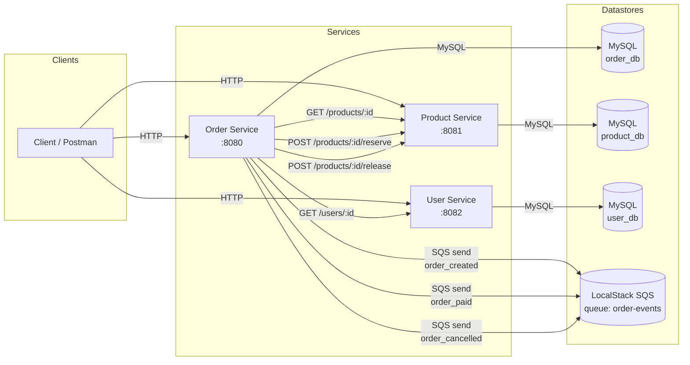
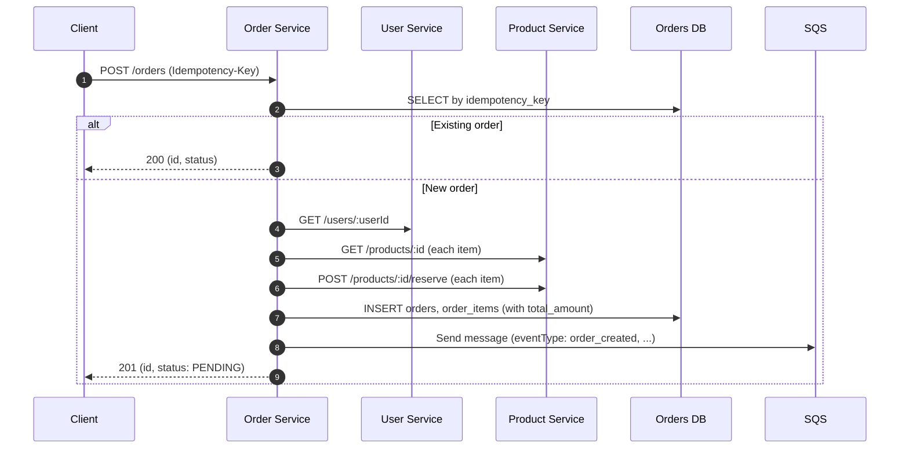
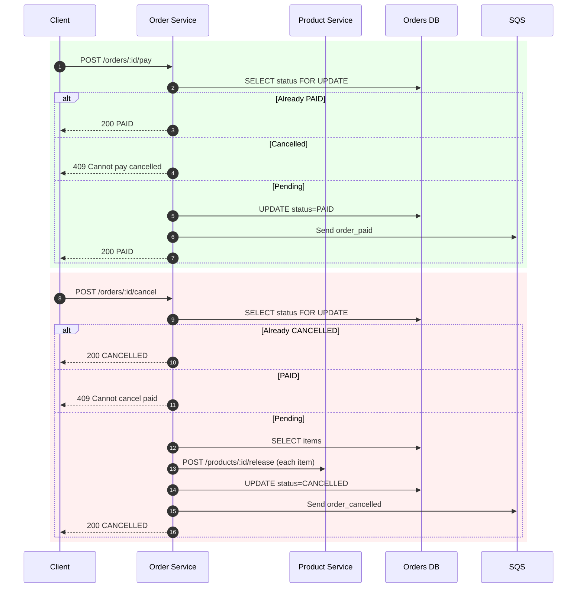

# E-commerce Microservices (Python, Flask, MySQL, SQS)

Services

- order_service (A): REST + MySQL + publishes SQS order events
- product_service (B): REST + MySQL (catalog)
- user_service (C): REST + MySQL (users)

Infra

- 3x MySQL containers
- LocalStack (SQS)
- Docker Compose to orchestrate

Quick start

- docker compose up -d --build
- docker compose logs -f order_service product_service user_service
- docker compose down -v

APIs

- OpenAPI specs in each service under openapi.yaml

# E-commerce Microservices Architecture

This repo contains three Python (Flask) microservices orchestrated with Docker Compose, each with its own MySQL database, plus LocalStack SQS for messaging.

## Component view

Key behaviors

- Order creation validates user and products, reserves stock, persists order + items, emits SQS event.
- Idempotency: POST /orders supports Idempotency-Key to avoid duplicate orders.
- Status transitions: PENDING → PAID or CANCELLED (cancel releases stock).

## Sequence: Place Order

## Sequence: Pay / Cancel Order

## Data model (simplified)

- users: id, username, email, password_hash, created_at, updated_at
- products: id, name, description, price, stock, created_at, updated_at
- orders: id, user_id, status(PENDING|PAID|CANCELLED), idempotency_key(uniq), total_amount, created_at, updated_at
- order_items: id, order_id, product_id, quantity, price

## Ports and endpoints

- User Service (8082): POST /api/v1/users, GET /api/v1/users/{id}, POST /api/v1/login, GET /health
- Product Service (8081): CRUD /api/v1/products, reserve/release, search, GET /health
- Order Service (8080): POST/GET /api/v1/orders, GET /api/v1/orders/{id}, POST /api/v1/orders/{id}/pay|cancel, GET /health

## Messaging

- LocalStack SQS (4566) with queue order-events.
- Events: order_created, order_paid, order_cancelled (JSON payloads).

## Notes

- Docker Compose brings up three MySQL instances, three services, and LocalStack SQS.
- Idempotency check is performed before external calls to avoid double reservation on retries.

