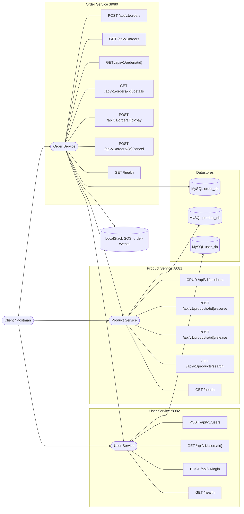

# E-commerce Microservices (Python, Flask, MySQL, SQS)

Services

- order_service (A): REST + MySQL + publishes SQS order events
- product_service (B): REST + MySQL (catalog)
- user_service (C): REST + MySQL (users)

Infra

- 3x MySQL containers
- LocalStack (SQS)
- Docker Compose to orchestrate

Quick start

- docker compose up -d --build
- docker compose logs -f order_service product_service user_service
- docker compose down -v

APIs

- OpenAPI specs in each service under openapi.yaml

# E-commerce Microservices Architecture

This repo contains three Python (Flask) microservices orchestrated with Docker Compose, each with its own MySQL database, plus LocalStack SQS for messaging.

## Architecture (single diagram)

Key behaviors

- Order creation validates user and products, reserves stock, persists order + items, emits SQS event.
- Idempotency: POST /orders supports Idempotency-Key to avoid duplicate orders.
- Status transitions: PENDING → PAID or CANCELLED (cancel releases stock).
